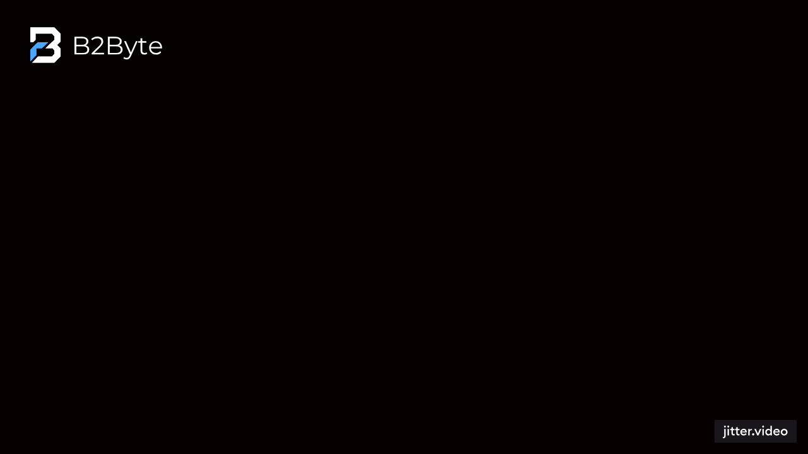

  

<h1 align="center">b2byte</h1>

  Building the future.

  Software house focused on web systems, automations and scalable digital products.

---

## About us

b2byte is a software company focused on building modern digital solutions with an emphasis on performance, design, innovation, and scalability.  
We create web systems, custom software, automations, and digital products designed to solve real business problems.

## What we do

- Web systems
- Custom software
- Process automation
- Institutional websites
- Internal tools and dashboards
- Scalable digital products

## Featured projects

### PluralOrto
A digital solution designed to modernize and optimize processes in the dental and clinical management space.

> More projects coming soon.

## Tech stack

- React
- TypeScript
- Node.js
- Python
- FastAPI
- PostgreSQL
- Tailwind CSS

## Our vision

We believe software should not only work — it should create impact, improve processes, and help businesses grow with intelligence and efficiency.

## Contact

- Website: coming soon
- LinkedIn: coming soon
- Email: coming soon

---

  Made with ambition, strategy and code by b2byte.

